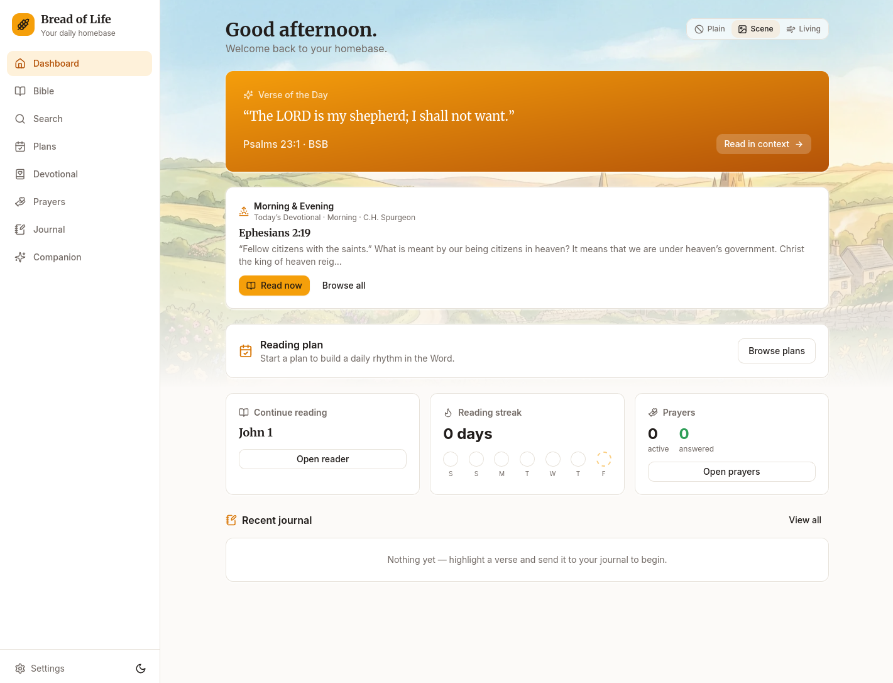
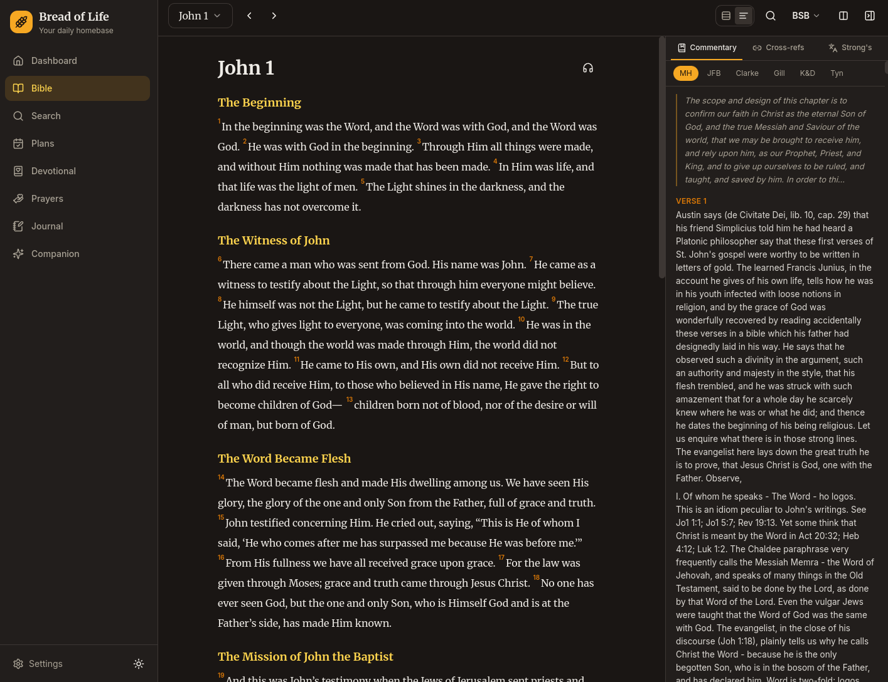

<div align="center">

# 🌾 Bread of Life

**A warm, offline-first home for your walk with Christ.**
Read the Word, keep a journal, and tend a prayer life you can look back on —
built for busy people who long to know God more.

### [**breadoflife.dev**](https://breadoflife.dev) · [Download](#-install-now) · [What's inside](#whats-inside)

**Latest: v0.3.0** — adds **Memory Lane** (memorise verses with spaced-repetition review), an
**on-rails guided reading-plan mode**, richer journal ↔ prayer cross-linking, a first-run onboarding
flow, custom prayer categories, mobile swipe-to-turn-chapter, a resizable/collapsible study layout,
and a fixed Linux AppImage for rolling distros. Builds on v0.2's optional cross-device sync and the
*Soul Food* Bible-in-a-year plan.

</div>

---

## ⬇️ Install now

Free and open source on every platform. Beta desktop builds are unsigned — a quick
"open anyway" and you're in.

| Platform | Get it |
|---|---|
| 🤖 **Android** | **[Install with Obtainium](https://apps.obtainium.imranr.dev/redirect.html?r=obtainium://app/%7B%22id%22%3A%20%22com.breadoflife.app%22%2C%20%22url%22%3A%20%22https%3A%2F%2Fgithub.com%2Fmatt-shearing%2Fbread-of-life%22%2C%20%22author%22%3A%20%22matt-shearing%22%2C%20%22name%22%3A%20%22Bread%20of%20Life%22%2C%20%22additionalSettings%22%3A%20%22%7B%5C%22apkFilterRegEx%5C%22%3A%20%5C%22bread-of-life%5C%22%2C%20%5C%22invertAPKFilter%5C%22%3A%20false%7D%22%2C%20%22overrideSource%22%3A%20%22GitHub%22%7D)** (auto-updates) · or [sideload the APK](https://github.com/matt-shearing/bread-of-life/releases/latest) |
| 🐧 **Linux** | [AppImage or `.deb`](https://github.com/matt-shearing/bread-of-life/releases/latest) · or on Arch: `yay -S bread-of-life-bin` |
| 🪟 **Windows** | [`.exe` installer](https://github.com/matt-shearing/bread-of-life/releases/latest) |
| 🍎 **macOS** | [Universal `.dmg`](https://github.com/matt-shearing/bread-of-life/releases/latest) (Apple Silicon + Intel) |

> **Android via Obtainium:** tap the link on your phone (with [Obtainium](https://github.com/ImranR98/Obtainium)
> installed) and it adds the app and keeps it updated from each GitHub release — no store, no account.
> See [`docs/MOBILE.md`](docs/MOBILE.md). Desktop details in [`docs/DESKTOP.md`](docs/DESKTOP.md).

## A look inside

<div align="center">

_A warm homebase for your day — and the Word with public-domain commentary, cross-references,
and Strong's word study right beside it._


&nbsp;


</div>

## What's inside

- **The whole Word, offline** — the Berean Standard Bible (CC0), all 66 books bundled for full offline
  use. Book/chapter nav, section headings, per-verse actions: highlight (5 colors), note, copy,
  → journal, → prayer. Your reading position and streak are remembered.
- **Answered-prayer log** ⭐ — add prayers, track how often you've prayed, and **mark them answered with a
  note on _how_ God answered**. A dedicated *Answered* view is your record of His faithfulness.
- **Journal** — rich entries with tags and verse links; capture a verse straight from the reader, and
  cross-link entries with the prayers they belong to (each side references the other).
- **Memory Lane** 🧠 — memorise verses from the reader and review them on a spaced-repetition
  schedule (SM-2), with fill-in-the-blank tests and a review streak to keep the habit warm.
- **Reading plans & devotionals** — structured plans (including **Soul Food**, a four-track
  *Bible-in-a-year*: an Old Testament, New Testament, Psalm and Proverbs portion every day) plus
  Spurgeon's *Morning & Evening* and more. Start a day and drop into a **guided on-rails reader**
  that ticks off each passage and remembers where you left off.
- **Commentary, cross-references & Strong's** — public-domain commentaries that track your chapter,
  OpenBible cross-references, and Greek/Hebrew word study, right beside the text.
- **AI study companion** — optional, grounded in the passage you're reading; bring your own key
  (Claude, OpenAI, Grok, Gemini, DeepSeek, or local Ollama). Private and entirely your choice.
- **Dashboard** — a warm landing: Verse of the Day, Continue Reading, reading streak, prayer counts,
  recent journal, over a cozy countryside scene.

All user data lives locally on your device (offline-first). No account is needed — the app is fully
usable with no cloud and no tracking.

## Cross-device sync (optional)

Want your prayers, journal, notes, highlights, reading progress and plans on more than one device?
Turn on sync in **Settings → Sync & account**. It stays offline-first — your device is always the
source of truth and sync is purely additive.

- **Hosted** — sign up in-app with an email + password to use the project's hosted sync service.
- **Self-hosted** — run your own server (your data, your box) and point the app at it under
  **Settings → Sync → Self-hosted**. The server is open source in [`deploy/sync-server`](deploy/sync-server)
  (a small Node service with a Docker Compose + Caddy setup); see its README to stand one up.

Local-only remains the default. End-to-end encryption of the synced payload is on the roadmap
(today the relay stores data server-side); see [`docs/ROADMAP.md`](docs/ROADMAP.md).

## Run it from source

```bash
pnpm install
pnpm fetch:bible     # downloads the BSB into public/bible/bsb/ (already present after first run)

pnpm dev             # run in a browser at http://localhost:1420
pnpm tauri:dev       # run as the native desktop app
pnpm build           # typecheck + production web build → dist/
pnpm tauri:build     # native installers (AppImage/deb on Linux, etc.)
```

**Stack:** Tauri 2 · React + Vite + TypeScript · Tailwind + Radix · Zustand (UI state) · Dexie (data).
Scripture & commentary come from the [HelloAO Free Use Bible API](https://bible.helloao.org).

## Requesting features & reporting bugs

Have an idea or hit a snag? Use the **Request a feature** button in the app (Settings), or
[open an issue](https://github.com/matt-shearing/bread-of-life/issues/new/choose). Feature requests are
triaged and turned into changes here.

## Docs & credits

- [`docs/ROADMAP.md`](docs/ROADMAP.md) — where this is headed.
- [`docs/MOBILE.md`](docs/MOBILE.md) · [`docs/DESKTOP.md`](docs/DESKTOP.md) — install & packaging.
- [`CREDITS.md`](CREDITS.md) — scripture & study data are public-domain / CC-BY.

The Berean Standard Bible is public domain (CC0). Bread of Life is free and open source under the
[MIT License](LICENSE) — made with ♥, offline-first, for the glory of God.
