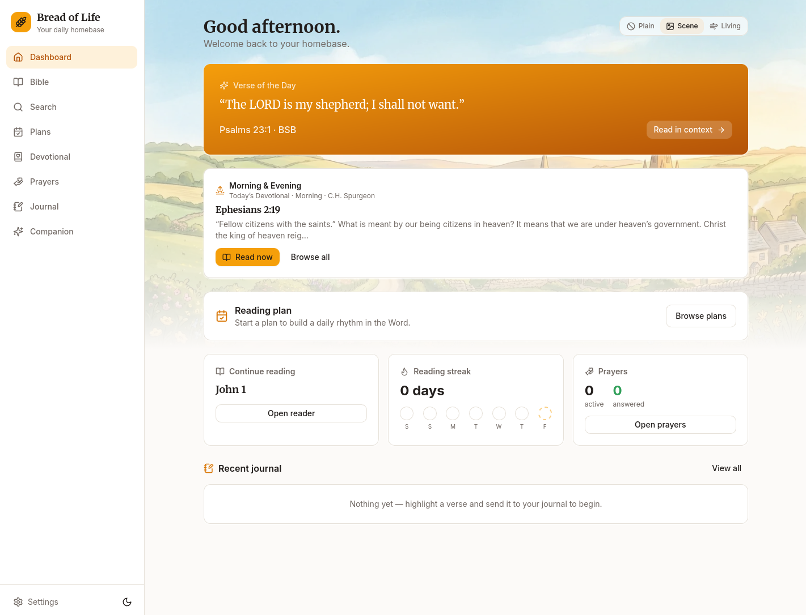
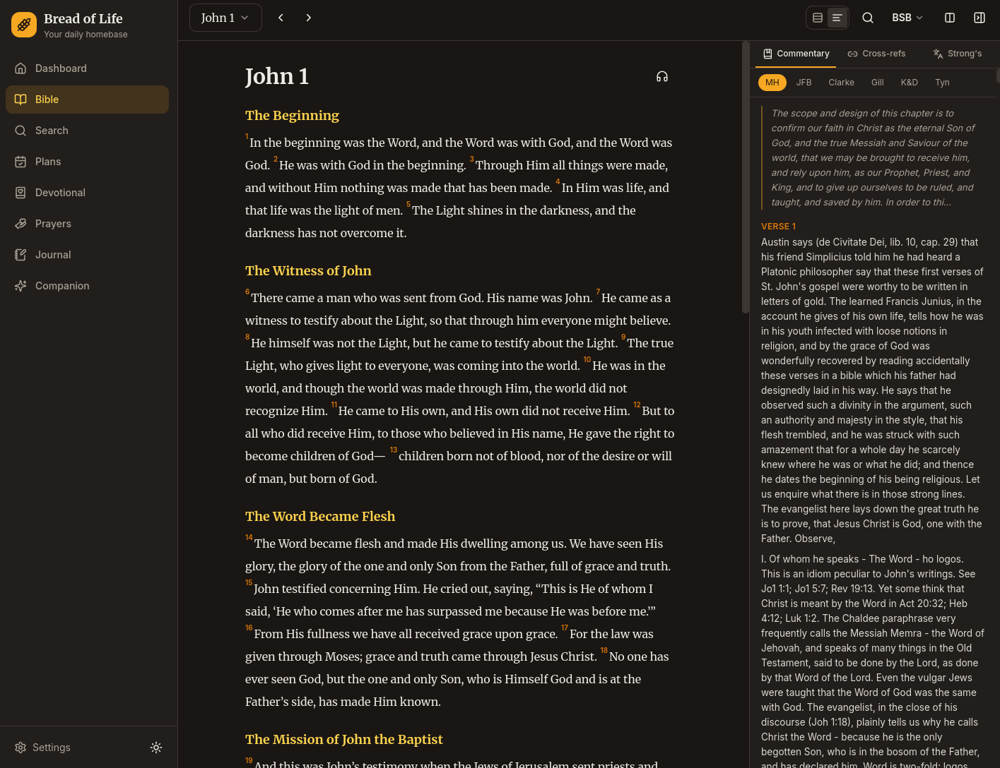

<div align="center">


# Bread of Life

**A warm, offline-first home for your walk with Christ.**
Read the Word, keep a journal, and tend a prayer life you can look back on —
built for busy people who long to know God more.

### [**breadoflife.dev**](https://breadoflife.dev) · [Download](#-install-now) · [What's inside](#whats-inside)

**Latest: v0.5.1** — **a new icon**: an arched window at first light, with a loaf on the sill. It
replaces the old loaf on every platform, including Android's single-colour themed icons and the
status bar during playback.

**v0.5.0** — **your record is safe, and easier to find**. **Back up** everything to one
file and restore it on any device, or **export** your journal, prayers and notes as Markdown. Every
reference now **opens on its verse**, with a bar to take you back. Type "jn 3:16" into search, or
press **Ctrl+K** on a keyboard to jump anywhere. A new **Reading history** page keeps every day you
read, so re-reading a chapter no longer breaks your streak, and the dashboard shows what God
answered **on this day** in earlier years. **Pray through** today's prayers one at a time; edit,
archive and restore prayers; and journal drafts are saved as you type. Now Playing gains a **sleep
timer** that fades the narration out. Sync no longer loses edits, the Bible fits the unfolded Fold,
and the app starts faster.

**v0.4.0** — **listen properly**. Pausing from your earphones and resuming no longer
loses the sound. Tap the player for a **Now Playing** screen that shows the day's readings as they
play, with a button to skip to the next reading. Bread of Life now works in **Android Auto**, with
tabs for today's reading, the Bible, the devotional and what you played recently, and it answers
"play John 3". **Spurgeon's Morning and Evening can be read aloud**, recorded in a warm British
voice, with your phone's own voice when you're offline. And **daily-reading reminders** (2 pm and
8 pm by default) stop once you've read, and mention your streak.

**v0.3.9** — **"All files access"** on Android done right: point the app at your **Missler library
anywhere** on your phone with a real **Browse…** folder picker, read it in place, and **play its
commentary audio** (now streamed through the native player). Reimplemented as a proper Kotlin plugin
after v0.3.7's approach crashed — plus the v0.3.8 Settings-crash fix and the desktop Browse picker.

**v0.3.8** — fixes an Android crash when opening **Settings**. Keeps the v0.3.7 **Missler library**
improvements: a **Browse…** folder picker on desktop, a permission-free `Android/media` **drop folder**
auto-created for you, and a fix so the **network import** works across a Tailscale-style host:port.

**v0.3.6** — press play on any chapter and the **audio Bible keeps rolling** — through the rest
of the book, then book after book to Revelation — straight through in the **background** (native
ExoPlayer playlist), with lock-screen controls and a mini-player. Reading plans do the same for the
day's readings. Built on the v0.3.3 audio player, **two Soul Food plans**, and Missler network import.

**v0.3.2** — a **Faithfulness review** (save your answered-prayer record as a PDF), a dedicated
**Commentary** section, **optional end-to-end encryption** of your synced journal/prayers/notes (with a
24-word recovery phrase), the **Missler Inspired** commentary + per-chapter audio, and deep-linking notifications.

**v0.3.0** — adds **Memory Lane** (memorise verses with spaced-repetition review), an
**on-rails guided reading-plan mode**, richer journal ↔ prayer cross-linking, a first-run onboarding
flow, custom prayer categories, mobile swipe-to-turn-chapter, a resizable/collapsible study layout,
and a fixed Linux AppImage for rolling distros. Builds on v0.2's optional cross-device sync and the
*Soul Food* Bible-in-a-year plan.

</div>

---

## ⬇️ Install now

Free and open source on every platform. Beta desktop builds are unsigned — a quick
"open anyway" and you're in.

| Platform | Get it |
|---|---|
| 🤖 **Android** | **[Install with Obtainium](https://apps.obtainium.imranr.dev/redirect.html?r=obtainium://app/%7B%22id%22%3A%20%22com.breadoflife.app%22%2C%20%22url%22%3A%20%22https%3A%2F%2Fgithub.com%2Fmatt-shearing%2Fbread-of-life%22%2C%20%22author%22%3A%20%22matt-shearing%22%2C%20%22name%22%3A%20%22Bread%20of%20Life%22%2C%20%22additionalSettings%22%3A%20%22%7B%5C%22apkFilterRegEx%5C%22%3A%20%5C%22bread-of-life%5C%22%2C%20%5C%22invertAPKFilter%5C%22%3A%20false%7D%22%2C%20%22overrideSource%22%3A%20%22GitHub%22%7D)** (auto-updates) · or [sideload the APK](https://github.com/matt-shearing/bread-of-life/releases/latest) |
| 🐧 **Linux** | [AppImage or `.deb`](https://github.com/matt-shearing/bread-of-life/releases/latest) · or on Arch: `yay -S bread-of-life-bin` |
| 🪟 **Windows** | [`.exe` installer](https://github.com/matt-shearing/bread-of-life/releases/latest) |
| 🍎 **macOS** | [Universal `.dmg`](https://github.com/matt-shearing/bread-of-life/releases/latest) (Apple Silicon + Intel) |

> **Android via Obtainium:** tap the link on your phone (with [Obtainium](https://github.com/ImranR98/Obtainium)
> installed) and it adds the app and keeps it updated from each GitHub release — no store, no account.
> See [`docs/MOBILE.md`](docs/MOBILE.md). Desktop details in [`docs/DESKTOP.md`](docs/DESKTOP.md).
>
> **Unsigned desktop builds:** on Windows, SmartScreen may warn you; choose **More info → Run anyway**.
> On macOS, right-click the app and choose **Open** the first time.

## A look inside

<div align="center">

_A warm homebase for your day — and the Word with public-domain commentary, cross-references,
and Strong's word study right beside it._


&nbsp;


</div>

## What's inside

- **The whole Word, offline** — the Berean Standard Bible (CC0), all 66 books bundled for offline
  use, plus WEB, KJV, ASV and YLT side by side. Tap a verse to highlight it (5 colours), add a note,
  copy it, memorise it, or take it to your journal or prayers. The app remembers the verse you were
  reading.
- **Find it and land on it** — search the Bible and your own journal, prayers and notes, or type a
  reference such as "jn 3:16". Every link opens on its verse, with a bar to take you back. On a
  keyboard, **Ctrl+K** jumps anywhere and the arrow keys turn the chapter.
- **Answered-prayer log** ⭐ — add prayers, track how often you've prayed, and **mark them answered with a
  note on _how_ God answered**. Edit, archive and restore prayers, and **pray through** today's list one
  at a time. The **Faithfulness review** gathers your answered prayers by year or month, with the verses
  and journal entries linked to each.
- **Journal** — rich entries with tags and verse links, saved as you type. Capture a verse straight from
  the reader, and cross-link entries with the prayers they belong to.
- **Reading history** — every day you read is kept: a calendar of the year, your streaks, and how much of
  each book you've read. The dashboard shows prayers answered and entries written **on this day** in
  earlier years.
- **Memory Lane** 🧠 — memorise verses from the reader and review them on a spaced-repetition
  schedule (SM-2), with fill-in-the-blank tests and a review streak to keep the habit warm.
- **Reading plans & devotionals** — structured plans (including **Soul Food**, a four-track
  *Bible-in-a-year*: an Old Testament, New Testament, Psalm and Proverbs portion every day) plus
  Spurgeon's *Morning & Evening* and *Faith's Checkbook*. Start a day and drop into a **guided reader**
  that ticks off each passage and remembers where you left off.
- **Listen** 🎧 — the audio Bible plays on in the background from chapter to chapter, with a
  **Now Playing** screen, a **sleep timer**, lock-screen and media-key controls, and **Android Auto**.
  *Morning & Evening* is read aloud too.
- **Reminders** — daily-reading reminders that stop once you've read, plus devotional, prayer and
  Memory Lane reminders at the times you choose.
- **Commentary, cross-references & Strong's** — public-domain commentaries that track your chapter,
  OpenBible cross-references, and Greek/Hebrew word study, right beside the text.
- **AI study companion** — optional, grounded in the passage you're reading; bring your own key
  (Claude, OpenAI, Grok, Gemini, DeepSeek, or local Ollama). Private and entirely your choice.
- **Dashboard** — a warm landing: a **Today** card for the plan reading, prayer and the devotional, the
  Verse of the Day, Continue Reading, your streak and prayer counts, over a cozy countryside scene.
- **Your data, yours to keep** — back up everything to one file and restore it on any device, or export
  your journal, prayers and notes as Markdown (it opens in any editor or an Obsidian vault).

All user data lives locally on your device (offline-first). No account is needed — the app is fully
usable with no cloud and no tracking.

## Cross-device sync (optional)

Want your prayers, journal, notes, highlights, reading progress and plans on more than one device?
Turn on sync in **Settings → Sync & account**. It stays offline-first — your device is always the
source of truth and sync is purely additive.

- **Hosted** — sign up in-app with an email + password to use the project's hosted sync service.
- **Self-hosted** — run your own server (your data, your box) and point the app at it under
  **Settings → Sync → Self-hosted**. The server is open source in [`deploy/sync-server`](deploy/sync-server)
  (a small Node service with a Docker Compose + Caddy setup); see its README to stand one up.

Local-only remains the default. Once signed in you can also turn on **end-to-end encryption**:
your journal, prayers and notes are encrypted on the device (AES-256-GCM) before they're sent, so
the server only stores ciphertext. You get a 24-word recovery phrase to unlock them on another
device; lose it and the synced copies can't be read (the copy on your device is unaffected). Other
synced data (highlights, reading progress, plans, settings) is stored on the server as sent.

With a v0.5 or later server, **Settings → Sync & account** also lets you sign out on all devices,
change your password and delete your account.

## Run it from source

```bash
pnpm install
pnpm fetch:bible     # downloads the BSB into public/bible/bsb/ (already present after first run)

pnpm dev             # run in a browser at http://localhost:1420
pnpm tauri:dev       # run as the native desktop app
pnpm build           # typecheck + production web build → dist/
pnpm lint && pnpm test   # what CI runs on every pull request, besides the build
pnpm test:sync       # sync tests, against the v0.4.0 server and the current one
pnpm tauri:build     # native installers (AppImage/deb on Linux, etc.)
```

**Stack:** Tauri 2 · React + Vite + TypeScript · Tailwind + Radix · Zustand (UI state) · Dexie (data).
Scripture & commentary come from the [HelloAO Free Use Bible API](https://bible.helloao.org).

## Requesting features & reporting bugs

Have an idea or hit a snag? Use the **Request a feature** button in the app (Settings), or
[open an issue](https://github.com/matt-shearing/bread-of-life/issues/new/choose). Feature requests are
triaged and turned into changes here.

## Docs & credits

- [`docs/ROADMAP.md`](docs/ROADMAP.md) — where this is headed.
- [`docs/MOBILE.md`](docs/MOBILE.md) · [`docs/DESKTOP.md`](docs/DESKTOP.md) — install & packaging.
- [`CREDITS.md`](CREDITS.md) — scripture & study data are public-domain / CC-BY.

The Berean Standard Bible is public domain (CC0). Bread of Life is free and open source under the
[MIT License](LICENSE) — made with ♥, offline-first, for the glory of God.
